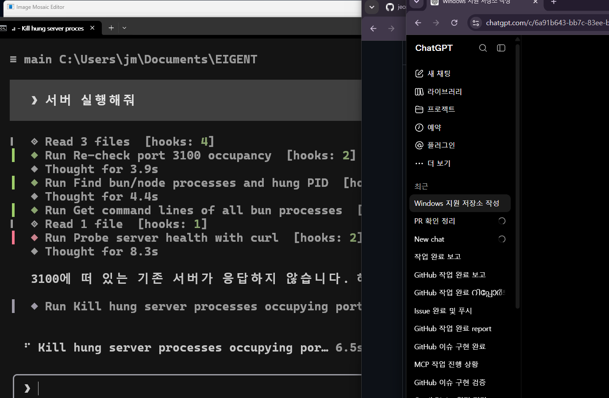
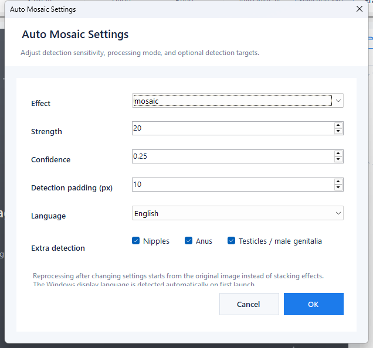

# Image Mosaic Editor

Windows에서 이미지의 검열 대상 영역을 자동으로 찾아 모자이크·블랙 마스크·블러를 적용하고, 수동 보정까지 할 수 있는 WinForms 이미지 편집기입니다.

> **지원 언어:** 한국어 · English · 日本語 · 简体中文  
> 첫 실행 시 Windows 표시 언어를 자동 감지하며, 이후 **Settings / 설정 → Language / 언어**에서 언제든 변경할 수 있습니다.

[](https://github.com/jeong-jimin-github/image-mozaic/actions/workflows/release.yml)


## Screenshots

### Main window



### Settings & language selection



## Features

- **Automatic censor-region detection** using `dghs-imgutils`
  - Primary genital-region detection
  - Optional nipple / anus / male-genital detection
- **Three processing modes**
  - Mosaic
  - Black mask
  - Gaussian blur
- **Precise region masking**
  - Detection boxes are refined with pixel-boundary segmentation instead of blindly censoring the entire rectangle.
- **GPU acceleration**
  - Uses CUDA through ONNX Runtime when available.
  - Automatically falls back to CPU when CUDA is unavailable.
- **Manual correction tools**
  - Drag to add a mosaic region.
  - Mask eraser restores incorrectly processed areas from the original image.
  - Undo / redo support.
- **Folder batch processing**
  - Drop a folder or choose one from the menu.
  - Results are written to a sibling `<folder-name>_mosaic` directory.
- **Drag & drop workflow** for individual images and folders.
- **Supported image formats:** JPG/JPEG, PNG, WEBP.

## Multilingual UI

The UI is available in four languages:

| Language | Locale handling |
| --- | --- |
| 한국어 | `ko-*` Windows UI locales |
| English | `en-*` and fallback for unsupported locales |
| 日本語 | `ja-*` Windows UI locales |
| 简体中文 | `zh-*` Windows UI locales |

On the first launch, the app checks the Windows UI locale (`CurrentUICulture`) and chooses the default language automatically. The user's choice is saved to:

```text
%LOCALAPPDATA%\ImageMosaicEditor\settings.json
```

Changing the language in **Settings → Language** updates the main menus, ribbon, status information, help text, settings UI, and automatic-processing progress messages. Python-side detection progress messages receive the same selected language through the application runtime.

## Download

Open the repository's [Releases](https://github.com/jeong-jimin-github/image-mozaic/releases) page and choose one of the two Windows x64 packages:

| Package | Recommended for |
| --- | --- |
| `ImageMosaicEditor-Setup-win-x64.exe` | Normal installation with Start Menu / uninstall registration |
| `ImageMosaicEditor-win-x64-Portable.zip` | Portable use without installation |

Both release packages are self-contained and include the .NET application, an embedded Python runtime, and the detection dependencies used by the app.

## Usage

1. Start **Image Mosaic Editor**.
2. Open an image, drag an image onto the window, or drop an entire folder.
3. Automatic detection processes the image using the current settings.
4. Correct the result when necessary:
   - **Selection Mode**: drag over an area to add a manual mosaic.
   - **Eraser Mode**: drag over an incorrectly censored area to restore pixels from the original image.
5. Save the edited image.

When a folder is batch-processed, a new `<folder-name>_mosaic` folder is created beside the input folder. Images with no detected target can be copied through unchanged as part of the batch output.

## Keyboard shortcuts

| Shortcut | Action |
| --- | --- |
| `Ctrl+O` | Open image |
| `Ctrl+S` | Save |
| `Ctrl+Shift+A` | Re-run automatic processing from the original image |
| `Ctrl+M` | Mosaic selection mode |
| `Ctrl+E` | Mask eraser mode |
| `Ctrl+Z` | Undo |
| `Ctrl+Y` | Redo |

## Automatic processing settings

Open **Settings** to configure:

- **Effect**: `mosaic`, `black`, or `blur`
- **Strength**
- **Confidence threshold**
- **Detection padding**
- **Additional detection targets**
- **Language**

Re-running automatic processing always starts from the original image, so changing the settings does not stack a second effect on top of an already processed result.

## Build from source

### Requirements

- Windows 10/11 x64
- .NET 8 SDK
- Python 3.10+ for local development of the automatic-detection bridge

### Build

```powershell
git clone https://github.com/jeong-jimin-github/image-mozaic.git
cd image-mozaic
dotnet restore ImageMosaicEditor.sln
dotnet build ImageMosaicEditor.sln -c Release
```

### Python dependencies

```powershell
python -m pip install -r python/requirements.txt
```

The GitHub Actions release workflow publishes a self-contained `win-x64` build and bundles Python 3.12 plus the required GPU-capable detection dependencies automatically.

## Technical overview

- **UI:** C# / .NET 8 / Windows Forms
- **Detection bridge:** Python
- **Detection:** `dghs-imgutils`
- **Inference:** ONNX Runtime GPU with automatic CPU fallback
- **Image processing:** Pillow + OpenCV
- **Release:** GitHub Actions, portable ZIP, Inno Setup installer

## Notes

- Detection is probabilistic. Always review the output before publishing or distributing an image.
- GPU acceleration requires a compatible NVIDIA/CUDA environment; otherwise CPU fallback is used automatically.
- Depending on the underlying detection library/model cache state, the first model initialization can require additional setup or network access.

---

## 한국어 요약

Image Mosaic Editor는 Windows용 자동 모자이크 편집기입니다. 이미지 또는 폴더를 드래그하면 자동 검출을 수행하고, 잘못 처리된 부분은 지우개로 원본 픽셀을 복원할 수 있습니다. 한국어/영어/일본어/중국어(간체)를 지원하며 첫 실행 언어는 Windows 로케일을 따르고 설정에서 변경할 수 있습니다.
